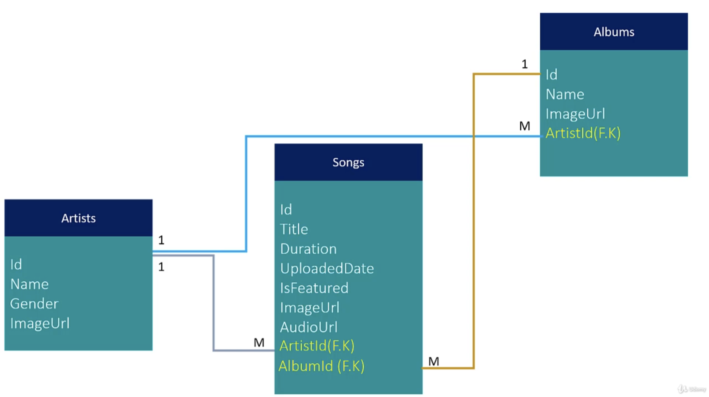
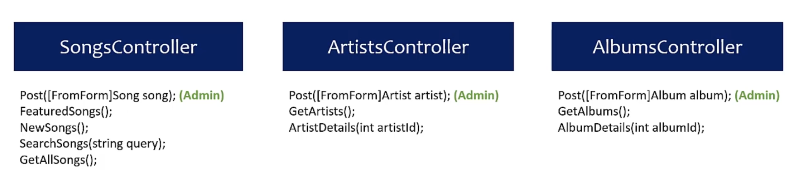

# asp-net-core

### Contents

- Basics of Restful Api
- String Data in Database with Entity Framework
- Error Handling & Http status Code
- Asynchronous API'S
- Content Negotiation & Migrations
- File Uploading Azure Blob Storage
- Validations & Routings
- Versioniing ( AspNetCore.Mvc.Versioning)
    - Query String
      > services.AddApiVersioning();
      ```csharp
        namespace QueryStringController 
        {
            // api/query?api-version=1.0
            [ApiVersion("1.0)]
            [Route("api/query")]
            public class QueryController
            {
            }
        }
      ```
      
    

- URL Path
- Media Types


### Commands
 dotnet add package Npgsql.EntityFrameworkCore.PostgreSQL

 dotnet ef migrations add InitialCreate

 dotnet ef database update


### Project (Artist, Albums & Songs)
#### Tables:

| Artists |      
| ------- |
| Id |
| Name |
| Gender |
| ImageUrl |
- Relation: 1 Artist -> M Song /// 1 Artitst -> M Album

| Songs |
| ------- |
| Id |
| Title |
| Duration |
| UploadedDate |
| IsFeatured |
| ImageUrl |
| AudioUrl |
| ArtistId(FK) |
| AlbumId(FK) |
- Relation: M Song -> 1 Album /// M Song -> Artist

| Albums |
| ------- |
| Id |
| Name |
| ImageUrl |
| ArtistId(FK) |
- Relation: M Albuns -> 1 Artist
#### tables


#### Controllers



